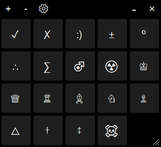

# Unicode Pad

Editing documents? Using Unicode symbols? Want to keep your frequently used ones to hand? Unicode Pad is for you!

Add your favourite symbols to the pad and simply drag and drop them from the window into your editor 
(provided it is supported, otherwise click the symbol and it will be placed on the clipboard - looking at you VSCode).

Binaries [here](https://github.com/stevehjohn/UnicodePad/raw/master/binaries/UnicodePad.zip) for your convenience.

